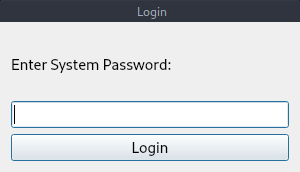
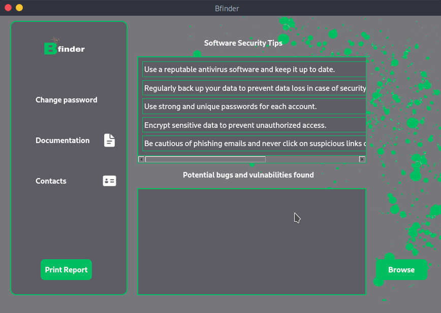
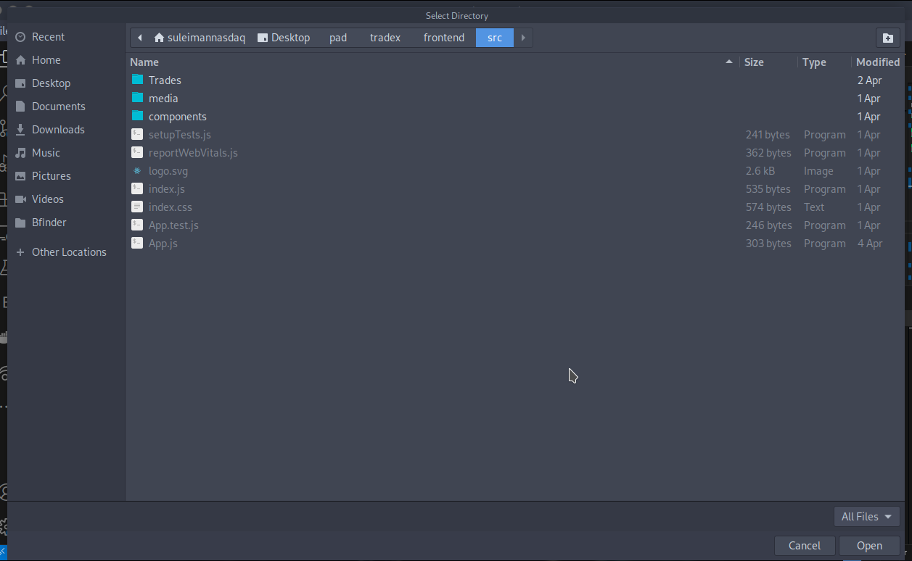
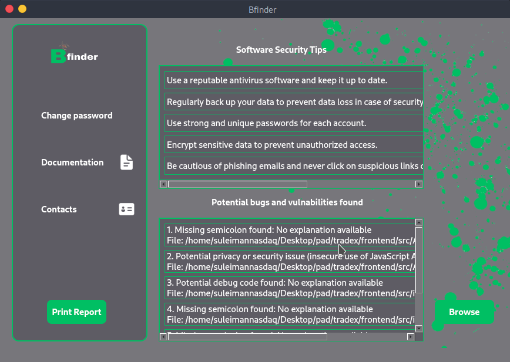
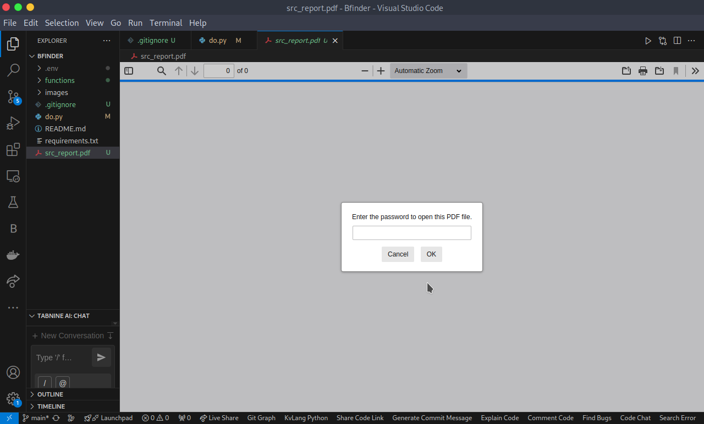

# Bfinder

Bfinder is a handy desktop application designed to help you keep your code clean and secure. It scans your HTML and JavaScript files to find and report any bugs or vulnerabilities. Whether you're a developer looking to catch issues before they become problems or just want to make sure your code is as secure as possible, Bfinder has got you covered. This guide will walk you through the installation and usage of Bfinder in five simple steps.

## Table of Contents
- [Bfinder](#bfinder)
  - [Table of Contents](#table-of-contents)
  - [1. Prerequisites](#1-prerequisites)
  - [2. Installation](#2-installation)
  - [3. Running Bfinder](#3-running-bfinder)
  - [4. Using Bfinder](#4-using-bfinder)
  - [5. Default Password](#5-default-password)

---

## 1. Prerequisites

Before you begin, ensure you have the following installed on your system:

- **Python 3.x**: Bfinder is written in Python. You can download Python from the [official website](https://www.python.org/downloads/).
- **Git**: For cloning the repository. Download it from [here](https://git-scm.com/downloads).

## 2. Installation

Follow these steps to install Bfinder:

1. **Clone the Repository**

   ```bash
   git clone https://github.com/ministerko/Bfinder.git
   ```

2. **Navigate to the Project Directory**

   ```bash
   cd Bfinder
   ```

3. **Install Required Dependencies**

   Bfinder relies on several Python packages. Install them using the following command:

   ```bash
   pip install -r requirements.txt
   ```

   *Note: If you encounter any permission issues, consider using `pip3` or adding `--user` to the command.*

## 3. Running Bfinder

To start Bfinder:

```bash
python main.py
```

*Alternatively, if `python` points to Python 2.x on your system, use:*

```bash
python3 main.py
```

## 4. Using Bfinder

Once Bfinder is running:

1. **Login Screen**

   Upon launching, you'll be greeted with a login screen. Enter your credentials to proceed.

    

2. **Main Interface**

   After logging in, you'll access the main interface where you can:

   - Search for files
   - Manage found files
   - Adjust settings

   


3. **Browse for Files**

   Use the Browse button to locate files *(currently it supports javascript and html)* .

   
   

4. **Get Vulnabilities and Bugs** 
   Once you have the files, you can get the vulnerabilities and bugs in the files. appers on down window 

   

5. **Print report when needed**

   

   

## 5. Default Password

For first-time users, the default password is:

```
1234
```

*It's highly recommended to change this default password after your initial login to ensure security.*

---

*If you encounter any issues or have questions, feel free to open an issue on the repository.*